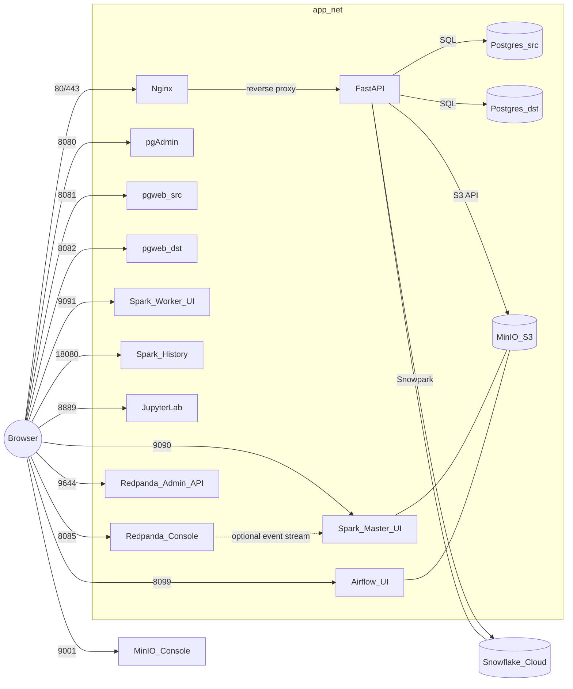

# Snowflake Terraform Demo

A portable, Terraform-managed development environment that stands up:

* **FastAPI** app (with hot reload for development)
* **Nginx** reverse proxy (public entry on port 80 → FastAPI)
* **Two PostgreSQL databases** (source & destination)
* **pgAdmin** (DB admin UI) on port **8080**
* **pgweb** (lightweight DB web UI) for source on **8081** and destination on **8082**
* **Apache Spark cluster** (master, workers, history server) on the shared Docker network

  * Spark Master UI → **9090**
  * Spark Worker UI → **9091**
  * Spark History UI → **18080**
* **JupyterLab (PySpark)** notebook environment on port **8889**
* **Airflow** (scheduler, webserver, workers, triggerer, Postgres/Redis backends) for orchestration on port **8099**

  * Airflow Web UI → **8099**
* Optional **MinIO** object storage service (S3-compatible) on ports **9000/9001**
* Optional **Redpanda/Kafka** for streaming ingestion and event-driven pipelines
* Planned **Snowflake + Snowpark** integration for advanced ETL and analytics


---
## Phase One status

✅ Complete — FastAPI, Nginx, Postgres, pgAdmin, and pgweb run in Docker, managed by Terraform; routing verified.

## Phase Two status

✅ Complete — Spark cluster and JupyterLab integrated; MinIO optional service available.

## Phase Three status

🚧 In progress — Airflow running in containers with Postgres/Redis backends; orchestration workflows under development. Redpanda/Kafka introduced for streaming, and Snowflake/Snowpark integration planned as the next major step.


---

## Table of Contents

* [Prerequisites](#prerequisites)
* [Repository Layout](#repository-layout)
* [Architecture](#architecture)
* [Quick Start](#quick-start)
* [Tear Everything Down](#tear-everything-down)
* [Terraform Commands](#terraform-commands)
* [Streaming Logs](#streaming-logs)
* [Service URLs](#service-urls)
* [Configuration (Variables)](#configuration-variables)
* [Development (Hot Reload)](#development-hot-reload)
* [Spark History](#spark-history)
* [Database Initialization](#database-initialization)
* [Nginx Routing Options](#nginx-routing-options)
* [Troubleshooting](#troubleshooting)
* [Testing](#testing-pytest)
* [Next Phases](#next-phases)
* [Road Map](#road-map)

---

## Prerequisites

* **Docker** & **Docker Engine** running locally (Linux, macOS, or WSL2)
* **Terraform** v1.5+ (kreuzwerker/docker provider \~> 3.x)
* **Bash** shell (for the helper commands in this README)
* **Python 3.11+** with `pip` (for running ETL scripts, tests, and Airflow DAG validation)
* **Node.js / npm** (optional, for front-end testing with Jupyter or future UI integration)

> On Linux, you may also want to increase inotify watches for hot reload (see [Development](#development-hot-reload)).


---

## Repository Layout

```
app/                         # FastAPI application code (mounted into the container)
infra/
  docker/
    main.tf                  # Terraform resources (containers, network, volumes)
    variables.tf             # Terraform input variables with defaults
    outputs.tf               # Handy URLs & commands after apply
    db-init/                 # Optional SQL files executed on Postgres init (bind-mounted)
    nginx/
      nginx.conf             # Reverse proxy config (port 80 → FastAPI; optional 443)
      certs/                 # (optional) TLS certs if using HTTPS locally
    spark/                   # Spark cluster Terraform configs and volume mounts
    airflow/                 # Airflow Terraform configs, DAGs mount, connections
    redpanda/                # Optional Redpanda/Kafka configs for streaming
```

> If you prefer Docker Compose, there is also an alternative compose-based layout you can evolve toward; Terraform is the standard for this project.


---
## Architecture


```mermaid
flowchart LR
Browser((Browser)) -->|80/443| Nginx[Nginx]
Nginx -->|reverse proxy| API[FastAPI]
API -->|SQL| SRC_DB[(Postgres_src)]
API -->|SQL| DST_DB[(Postgres_dst)]
API -->|Snowpark| SNOWFLAKE[(Snowflake_Cloud)]
API -->|S3 API| MINIO[(MinIO_S3)]


%% Direct-host UIs
Browser -->|8080| PGADMIN[pgAdmin]
Browser -->|8081| PGWEB_SRC[pgweb_src]
Browser -->|8082| PGWEB_DST[pgweb_dst]
Browser -->|9090| SPARK_MASTER[Spark_Master_UI]
Browser -->|9091| SPARK_WORKER[Spark_Worker_UI]
Browser -->|18080| SPARK_HISTORY[Spark_History]
Browser -->|8889| JUPYTER[JupyterLab]
Browser -->|8099| AIRFLOW_UI[Airflow_UI]
Browser -->|8085| RP_CONSOLE[Redpanda_Console]
Browser -->|9644| RP_ADMIN[Redpanda_Admin_API]
Browser -->|9001| MINIO_CONSOLE[MinIO_Console]


subgraph app_net
  Nginx
  API
  SRC_DB
  DST_DB
  PGADMIN
  PGWEB_SRC
  PGWEB_DST
  SPARK_MASTER
  SPARK_WORKER
  SPARK_HISTORY
  JUPYTER
  AIRFLOW_UI
  RP_CONSOLE
  RP_ADMIN
  MINIO
end

%% Data flows
SPARK_MASTER --- MINIO
AIRFLOW_UI --- MINIO
RP_CONSOLE -. optional event stream .-> SPARK_MASTER
SNOWFLAKE --- API
```

All containers run on isolated Docker network **app\_net**.

**Published host ports**: 80, 8080, 8081, 8082, 9090, 9091, 18080, 8889, 8099, 8085, 9644, 9000, 9001.

---

## Quick Start & Startup Instructions

### Quick Start

```bash
# From repo root
cp -n .env.example .env

# (Recommended) Fill in .env and auto-generate secrets (Fernet, passwords, etc.)
chmod +x setup.sh
./setup.sh   # use --ci in automation to require everything be present

# Initialize Terraform (installs ARM-friendly docker provider on Pi)
terraform -chdir=infra/docker init -upgrade

# Bring everything up (setup.sh writes the var-file used here)
terraform -chdir=infra/docker apply -auto-approve -var-file="env.auto.tfvars.json"

# See convenient URLs/ports
terraform -chdir=infra/docker output service_urls

# Verify ports & containers
docker ps

# Smoke tests (via nginx)
curl -I http://localhost/
curl -sS http://localhost/health

# Service health checks
curl -sS http://localhost:8099/health        # Airflow webserver health
curl -sS http://localhost:9644/v1/status/ready  # Redpanda ready

# Open UIs
# FastAPI (through nginx):   http://localhost/
# Airflow Web UI:            http://localhost:8099/
# pgAdmin:                   http://localhost:8080/
# pgweb (source):            http://localhost:8081/
# pgweb (destination):       http://localhost:8082/
# Spark Master:              http://localhost:9090/
# Spark Worker-1:            http://localhost:9091/
# Spark History:             http://localhost:18080/
# JupyterLab:                http://localhost:8889/?token=dev
# MinIO Console:             http://localhost:9001/
# Redpanda Console:          http://localhost:8085/
# Redpanda Admin Ready:      http://localhost:9644/v1/status/ready
```


## Startup Instructions

Follow these steps to get your development environment running:

1. **Clone the Repository**

   ```bash
   git clone https://github.com/Cole-Dylewski/snowflake-terraform-demo.git
   cd snowflake-terraform-demo
   git clone https://github.com/Cole-Dylewski/_utils
   ```

2. **Set Up Environment Variables**

   * Copy the example file:

     ```bash
     cp .env.example .env
     ```
   * Or run the helper script to generate and validate your `.env` and `env.auto.tfvars.json`:

     ```bash
     chmod +x setup.sh
     ./setup.sh
     ```

     *Tip:* `setup.sh` auto-generates **Airflow** secrets (admin password + Fernet key) and writes Terraform vars for you.
     If you want it to run Terraform too, use:

     ```bash
     ./setup.sh --apply
     ```

     (Then you can skip Step 3.)

3. **Build and Start Services (Terraform)**

   ```bash
   terraform -chdir=infra/docker init -upgrade
   terraform -chdir=infra/docker apply -auto-approve -var-file="env.auto.tfvars.json"
   ```

   > The `setup.sh` script generates `infra/docker/env.auto.tfvars.json`.
   > With `-chdir=infra/docker`, the `-var-file` path is relative to that directory.

4. **Verify Services Are Running**

   ```bash
   docker ps --format 'table {{.Names}}\t{{.Ports}}'
   ```

5. **Access Services**

   | Service             | URL / Port                                         |
   | ------------------- | -------------------------------------------------- |
   | FastAPI (via nginx) | [http://localhost](http://localhost)               |
   | Health Check        | [http://localhost/health](http://localhost/health) |
   | pgAdmin             | [http://localhost:8080](http://localhost:8080)     |
   | pgweb (source)      | [http://localhost:8081](http://localhost:8081)     |
   | pgweb (destination) | [http://localhost:8082](http://localhost:8082)     |
   | Spark Master        | [http://localhost:9090](http://localhost:9090)     |
   | Spark Worker        | [http://localhost:9091](http://localhost:9091)     |
   | Spark History       | [http://localhost:18080](http://localhost:18080)   |
   | JupyterLab          | [http://localhost:8889](http://localhost:8889)     |
   | Airflow Web UI      | [http://localhost:8099](http://localhost:8099)     |
   | MinIO API           | [http://localhost:9000](http://localhost:9000)     |
   | MinIO Console       | [http://localhost:9001](http://localhost:9001)     |
   | Redpanda Console    | [http://localhost:8085](http://localhost:8085)     |
   | Redpanda Admin API  | [http://localhost:9644](http://localhost:9644)     |

6. **Stop Services**

   ```bash
   terraform -chdir=infra/docker destroy -auto-approve
   ```

   **OR** perform a full Docker cleanup (removes all containers, images, networks, and Terraform state):

   ```bash
   #!/usr/bin/env bash
   terraform -chdir=infra/docker destroy -auto-approve
   
   set -Eeuo pipefail

   echo ">>> Stopping & removing ALL containers…"
   docker rm -f $(docker ps -aq) 2>/dev/null || true

   echo ">>> Removing ALL images…"
   docker rmi -f $(docker images -aq) 2>/dev/null || true

   echo ">>> Pruning ALL networks (that aren’t in use)…"
   docker network prune -f || true

   echo ">>> Pruning ALL UNUSED volumes (data loss for unused volumes)…"
   docker volume prune -f || true

   echo ">>> Wiping Terraform working dir + state for this module…"
   rm -rf infra/docker/.terraform
   rm -f  infra/docker/.terraform.lock.hcl
   rm -f  infra/docker/terraform.tfstate infra/docker/terraform.tfstate.backup

   echo ">>> Done (system-wide Docker clean)."
   echo "Next:"
   echo "  terraform -chdir=infra/docker init -upgrade"
   echo '  terraform -chdir=infra/docker apply -auto-approve -var-file="env.auto.tfvars.json"'
   ```

### Health Checks

Use these commands to validate that key services are healthy after startup:

```bash
# FastAPI (JSON health)
curl -sS http://localhost/health | jq .

# Airflow Webserver (HEAD is safe even if auth is required)
curl -I http://localhost:8099/ | head -n 1

# MinIO API readiness & liveness
curl -sS http://localhost:9000/minio/health/ready && echo " -> MinIO ready"
curl -sS http://localhost:9000/minio/health/live && echo " -> MinIO live"

# MinIO Console (login page should return headers)
curl -I http://localhost:9001/ | head -n 1

# Redpanda Ready API
curl -sS http://localhost:9644/v1/status/ready | jq .

# Spark Master UI (HTML headers)
curl -I http://localhost:9090/ | head -n 1
```

> 💡 If you enabled MinIO via `ENABLE_MINIO=true`, both the API (9000) and Console (9001) checks above should pass. If not, confirm the setting in your `env.auto.tfvars.json` and re-apply Terraform.


---
## Tear Everything Down

When you’re done experimenting, this section lets you **fully reset** the environment. It includes a **project-only teardown** and a **nuclear option** that wipes Docker entirely (containers, networks, images, **and volumes**, including databases).

> ⚠️ **Data loss warning:** Commands that remove volumes will erase Postgres databases and any data stored in MinIO or other project volumes.

### 1) Standard Teardown (Terraform‑managed)

Stops and removes only what this project created via Terraform.

```bash
# From repo root
terraform -chdir=infra/docker destroy -auto-approve
```

If Terraform reports resources "in use" or some containers linger, remove likely containers/volumes and try again:

```bash
# Kill project containers if still alive (ignore if missing)
docker rm -f \
  nginx api \
  src_db dst_db pgadmin pgweb_src pgweb_dst \
  spark_master spark_worker_1 spark_history jupyter \
  airflow_web airflow_scheduler airflow_worker airflow_triggerer airflow_redis airflow_db \
  redpanda redpanda_console \
  minio 2>/dev/null || true

# Remove likely project networks (ignore if missing)
docker network rm app_net 2>/dev/null || true

# Remove project volumes (ignore if missing) — this ERASES DBs & object storage
docker volume rm -f \
  src_db_data dst_db_data \
  airflow_db_data airflow_logs airflow_dags \
  spark_events \
  minio_data \
  redpanda_data 2>/dev/null || true

# Retry destroy
terraform -chdir=infra/docker destroy -auto-approve
```

If the Terraform state is corrupted (resources don’t exist but state says they do), you can surgically remove them from state and re-run destroy:

```bash
terraform -chdir=infra/docker state list | cat
# Example removals (adjust as needed)
terraform -chdir=infra/docker state rm \
  docker_container.nginx \
  docker_container.api \
  docker_container.src_db \
  docker_container.dst_db \
  docker_container.pgadmin \
  docker_container.pgweb_src \
  docker_container.pgweb_dst \
  docker_container.spark_master \
  docker_container.spark_worker_1 \
  docker_container.spark_history \
  docker_container.jupyter \
  docker_container.airflow_web \
  docker_container.airflow_scheduler \
  docker_container.airflow_worker \
  docker_container.airflow_triggerer \
  docker_container.airflow_redis \
  docker_container.airflow_db \
  docker_container.redpanda \
  docker_container.redpanda_console \
  docker_container.minio
```

If the working directory or lock files are wedged, reset the Terraform folder:

```bash
rm -rf infra/docker/.terraform \
       infra/docker/.terraform.lock.hcl \
       infra/docker/terraform.tfstate \
       infra/docker/terraform.tfstate.backup 2>/dev/null || true
```

### 2) Nuclear Option (wipe **all** Docker)

Use this to return Docker to a **factory‑fresh** state. This removes **every** container, image, network (except defaults), **and all volumes** on your machine.

```bash
# Kill ALL containers
docker rm -f $(docker ps -aq) 2>/dev/null || true

# Remove ALL volumes (DBs, MinIO buckets, etc.)
docker volume rm -f $(docker volume ls -q) 2>/dev/null || true

# Remove ALL networks (except default)
docker network prune -f || true

# Remove ALL images and builder cache
docker image prune -af || true
docker builder prune -af || true

# Optional: prune everything (double‑coverage)
docker system prune -af --volumes || true
```

After that, your Docker environment is completely clean. Recreate the stack with:

```bash
terraform -chdir=infra/docker init -upgrade
terraform -chdir=infra/docker apply -auto-approve -var-file="env.auto.tfvars.json"
```

**Notes**

* If you stored a generated var-file at a different path, update the `-var-file` accordingly.
* If you used custom names for containers/volumes, add them to the lists above before running the cleanup.
* On Linux/macOS, you can wrap either teardown into a script under `scripts/cleanup.sh` and make it executable.

---

## Terraform Commands

Terraform manages all containers, volumes, and networks under `infra/docker/`.

```bash
# Initialize providers (first run or after provider changes)
terraform -chdir=infra/docker init -upgrade

# Plan / Apply using the var-file generated by setup.sh
terraform -chdir=infra/docker plan  -var-file="env.auto.tfvars.json"
terraform -chdir=infra/docker apply -auto-approve -var-file="env.auto.tfvars.json"

# Show handy outputs (URLs)
terraform -chdir=infra/docker output           # all outputs
terraform -chdir=infra/docker output service_urls

# Target specific modules/resources during iteration (examples)
terraform -chdir=infra/docker apply -auto-approve -target=module.spark_cluster
terraform -chdir=infra/docker apply -auto-approve -target=module.airflow
terraform -chdir=infra/docker apply -auto-approve -target=module.redpanda

# Destroy everything managed by Terraform
terraform -chdir=infra/docker destroy -auto-approve
```

**Notes**

* The file `/tmp/env.auto.tfvars.json` is produced by `setup.sh` from your `.env` and includes Airflow credentials and ports.
* Use `-upgrade` with `init` if provider versions change.
* If Docker is wedged during development, a quick reset:

```bash
docker ps -aq | xargs -r docker stop
docker ps -aq | xargs -r docker rm
docker network prune -f
# Optional & destructive: docker volume prune -f  # (wipes DB/object-store data)
```


---
## Streaming Logs

### FastAPI (main app)

```bash
docker logs -f api
```

### Postgres (source & destination)

```bash
docker logs -f src_db
docker logs -f dst_db
```

### pgAdmin

```bash
docker logs -f pgadmin
```

### pgweb (source & destination)

```bash
docker logs -f pgweb_src
docker logs -f pgweb_dst
```

### Nginx

```bash
docker logs -f nginx
```

### Spark (master, workers, history)

```bash
docker logs -f spark_master
docker logs -f spark_worker_1
docker logs -f spark_history
```

### JupyterLab

```bash
docker logs -f jupyter
```

### Airflow (webserver, scheduler, worker, triggerer, Redis, DB)

```bash
docker logs -f airflow_web
docker logs -f airflow_scheduler
docker logs -f airflow_worker
docker logs -f airflow_triggerer
docker logs -f airflow_redis
docker logs -f airflow_db
```

### Redpanda (broker, console) & Admin API

```bash
docker logs -f redpanda
docker logs -f redpanda_console
curl -sS http://localhost:9644/v1/status/ready | jq .
```

### MinIO (server & console)

```bash
docker logs -f minio
# Console is a UI; verify with curl -I
curl -I http://localhost:9001/
```

---

## 📑 Tips

* Add `--tail 100` if you only want the last 100 lines:

  ```bash
  docker logs -f --tail 100 api
  ```
* Open multiple terminals (one per service) to watch several logs at once.
* To stop following, press `Ctrl+C`.
* List containers with names & ports to find exact container names:

  ```bash
  docker ps --format 'table {{.Names}}\t{{.Ports}}'
  ```

---

## Service URLs

* **FastAPI (via nginx)**: [http://localhost/](http://localhost/)

  * Health: [http://localhost/health](http://localhost/health)
* **pgAdmin**: [http://localhost:8080/](http://localhost:8080/)
* **pgweb (source)**: [http://localhost:8081/](http://localhost:8081/)
* **pgweb (destination)**: [http://localhost:8082/](http://localhost:8082/)
* **Spark Master**: [http://localhost:9090/](http://localhost:9090/)
* **Spark Worker-1**: [http://localhost:9091/](http://localhost:9091/)
* **Spark History**: [http://localhost:18080/](http://localhost:18080/)
* **JupyterLab**: [http://localhost:8889/](http://localhost:8889/)
* **Airflow Web UI**: [http://localhost:8099/](http://localhost:8099/)
* **MinIO Console**: [http://localhost:9001/](http://localhost:9001/)
* **Redpanda Console**: [http://localhost:8085/](http://localhost:8085/)
* **Redpanda Admin (readiness)**: [http://localhost:9644/v1/status/ready](http://localhost:9644/v1/status/ready)

**Direct Postgres from host**

* Source: `psql -h 127.0.0.1 -p 5433 -U src_user src_db`
* Destination: `psql -h 127.0.0.1 -p 5434 -U dst_user dst_db`

If you set a custom JUPYTER\_TOKEN, open: `http://localhost:8889/?token=<your-token>`.


---
## Configuration (Variables)

Defaults live in `infra/docker/variables.tf` — override at apply-time with `-var` or a `.tfvars` file.

| Variable               |             Default | Purpose                                                    |
| ---------------------- | ------------------: | ---------------------------------------------------------- |
| `src_db_user`          |          `src_user` | Source DB username                                         |
| `src_db_password`      |          `src_pass` | Source DB password                                         |
| `src_db_name`          |            `src_db` | Source DB name                                             |
| `dst_db_user`          |          `dst_user` | Destination DB username                                    |
| `dst_db_password`      |          `dst_pass` | Destination DB password                                    |
| `dst_db_name`          |            `dst_db` | Destination DB name                                        |
| `api_port`             |              `8000` | Host port for FastAPI container (Nginx still fronts on 80) |
| `src_host_port`        |              `5433` | Host port mapped to source Postgres                        |
| `dst_host_port`        |              `5434` | Host port mapped to destination Postgres                   |
| `pgadmin_port`         |              `8080` | Host port for pgAdmin                                      |
| `pgadmin_email`        | `admin@example.com` | pgAdmin admin login                                        |
| `pgadmin_password`     |             `admin` | pgAdmin admin password                                     |
| `http_port`            |                `80` | Host port for Nginx                                        |
| `pgweb_src_port`       |              `8081` | Host port for pgweb (source)                               |
| `pgweb_dst_port`       |              `8082` | Host port for pgweb (destination)                          |
| `SPARK_WORKER_COUNT`   |                 `1` | Number of Spark workers                                    |
| `SPARK_WORKER_CORES`   |                 `2` | Cores per worker                                           |
| `SPARK_WORKER_MEMORY`  |                `2g` | Memory per worker                                          |
| `JUPYTER_PORT`         |              `8889` | Host port for JupyterLab                                   |
| `JUPYTER_TOKEN`        |               `dev` | Jupyter token (URL auth)                                   |
| `SPARK_MASTER_PORT`    |              `7077` | Spark master RPC port                                      |
| `SPARK_MASTER_UI_PORT` |              `9090` | Spark master UI port                                       |
| `SPARK_WORKER_UI_BASE` |              `9091` | First worker UI port                                       |
| `SPARK_HISTORY_PORT`   |             `18080` | History server UI port                                     |
| `ENABLE_MINIO`         |             `false` | Enable S3-compatible MinIO (optional)                      |
| `MINIO_PORT`           |              `9000` | MinIO S3 API port                                          |
| `MINIO_CONSOLE_PORT`   |              `9001` | MinIO web console port                                     |
| `ENABLE_AIRFLOW`       |              `true` | Enable Airflow orchestration                               |
| `AIRFLOW_PORT`         |              `8099` | Airflow web UI port                                        |
| `AIRFLOW_FERNET_KEY`   |          *(random)* | Encryption key for Airflow secrets                         |
| `AIRFLOW_ADMIN_USER`   |             `admin` | Airflow admin username                                     |
| `AIRFLOW_ADMIN_PASS`   |          `changeme` | Airflow admin password                                     |
| `ENABLE_REDPANDA`      |             `false` | Enable Redpanda/Kafka (optional)                           |
| `REDPANDA_CONSOLE`     |              `8085` | Redpanda console port                                      |
| `REDPANDA_ADMIN_PORT`  |              `9644` | Redpanda admin API port                                    |

**Examples:**

```bash
# Change pgAdmin port
terraform -chdir=infra/docker apply -auto-approve -var pgadmin_port=9090

# Use non-default DB creds
terraform -chdir=infra/docker apply -auto-approve \
  -var src_db_user=alice -var src_db_password=secret -var src_db_name=src

# Disable MinIO and Redpanda
terraform -chdir=infra/docker apply -auto-approve \
  -var ENABLE_MINIO=false -var ENABLE_REDPANDA=false
```


---
## Development (Hot Reload)

The FastAPI container mounts your local `app/` folder and runs `uvicorn` with `--reload` so code changes trigger automatic restarts.

**Health endpoint**: `/health` (container HEALTHCHECK hits `http://127.0.0.1:8000/health`).

### Spark & Jupyter

* The Spark cluster and JupyterLab are configured to mount volumes for notebooks and Spark event logs, so code changes and job history are visible immediately.
* Jupyter notebooks under `app/notebooks/` are live-mounted into the container.

### Airflow

* DAGs are mounted from your local `infra/docker/airflow/dags/` folder into the Airflow webserver, scheduler, and workers.
* Updating a DAG file locally will trigger reloads inside the Airflow containers.

### MinIO & Redpanda

* Both run as optional services; configs can be updated locally and mounted into containers.

### Linux watch limits

If reloads don’t trigger on Linux, increase file watch limits:

```bash
echo fs.inotify.max_user_watches=524288 | sudo tee -a /etc/sysctl.conf
echo fs.inotify.max_user_instances=1024 | sudo tee -a /etc/sysctl.conf
sudo sysctl -p
```
## Dependency Changes

The FastAPI Dockerfile uses a build arg `REQ_HASH` (hash of `requirements.txt`). When you edit `app/requirements.txt`, a subsequent `terraform apply` will rebuild the FastAPI image automatically:

```bash
# Add a dependency
echo "pandas" >> app/requirements.txt

# Rebuild via Terraform
terraform -chdir=infra/docker apply -auto-approve
```

When you only change Python code (not requirements), hot reload picks it up instantly (no rebuild needed).

### Airflow

Airflow dependencies are managed in its container image. If you edit `infra/docker/airflow/requirements.txt`, Terraform will trigger a rebuild of the Airflow image with the new providers or Python libraries.

### Jupyter

Custom notebook dependencies can be added in `app/requirements.txt` or an optional `notebooks/requirements.txt` file and mounted into the Jupyter container at startup.

### Spark

Spark and worker images include common Python libs (PySpark, requests). If you require additional Python dependencies for Spark jobs, add them to the shared requirements files so they rebuild with the FastAPI/worker images.

---

### Jupyter (container) dependencies

You can install extra Python packages inside the **JupyterLab** container at startup via a bind-mounted requirements file.

1. Create or edit `infra/requirements-jupyter.txt`, e.g.:

```text
pyspark
pandas
matplotlib
requests
```

2. On container start, this file is mounted to `/tmp/requirements.txt` and the container runs:

```bash
pip install -r /tmp/requirements.txt && exec start-notebook.sh
```

3. Recreate Jupyter to apply changes:

```bash
terraform -chdir=infra/docker apply -auto-approve -target=module.spark_cluster.docker_container.jupyter
```

---
## Spark History

### Spark History UI requires event logs

The History Server displays applications **only after** it finds Spark event logs in the shared volume.

* Shared Docker volume: `spark_events`
* Mounted path (in Spark/Jupyter containers): `/opt/bitnami/spark/tmp/spark-events`
* Jupyter/driver must set:

  * `spark.eventLog.enabled=true`
  * `spark.eventLog.dir=file:/opt/bitnami/spark/tmp/spark-events`

These settings are already injected into the Jupyter container via `PYSPARK_SUBMIT_ARGS`.

#### Quick test (inside Jupyter)

Create a new notebook and run:

```python
from pyspark.sql import SparkSession
spark = (SparkSession.builder
         .master("spark://spark-master:7077")
         .appName("hist-check")
         .getOrCreate())

spark.range(100000).selectExpr("sum(id)").show()
spark.stop()
```

Then open **[http://localhost:18080/](http://localhost:18080/)** to view the Spark History UI.

#### If permissions block writing event logs

Run once in the Spark master container to ensure the directory exists and is world‑writable:

```bash
docker exec -it spark-master bash -lc 'mkdir -p /opt/bitnami/spark/tmp/spark-events && chmod 0777 /opt/bitnami/spark/tmp/spark-events'
```

> Re-running with clean state requires wiping the associated Docker **volume** (destructive).


---
## Database Initialization

Place SQL files under `infra/docker/db-init/`. They are bind-mounted into both Postgres containers at `/docker-entrypoint-initdb.d` and executed **once** when a new data directory is created.

**Example:** `infra/docker/db-init/001_seed.sql`

```sql
-- Source DB seed
CREATE TABLE IF NOT EXISTS events_src(id SERIAL PRIMARY KEY, note TEXT);
INSERT INTO events_src(note) VALUES ('seed 1'),('seed 2'),('seed 3');

-- Destination DB seed
CREATE TABLE IF NOT EXISTS events_dst(id SERIAL PRIMARY KEY, note TEXT);
INSERT INTO events_dst(note) VALUES ('seed A'),('seed B'),('seed C');
```

> Re-running seeds requires wiping the associated Docker **volume** (destructive).

### Notes

* File execution order follows alphanumeric sorting (`001_`, `002_`, etc.).
* Each script is run only on first initialization of the container’s data directory.
* To reset and reapply initialization scripts:

  ```bash
  docker volume rm -f src_db_data dst_db_data
  terraform -chdir=infra/docker apply -auto-approve
  ```
* Place schema migrations or seeds here for quick demos; for production consider a migration tool (Flyway, Alembic, Liquibase).

---

## Nginx Routing Options

**Current setup:** Nginx proxies **all** paths on port **80** to FastAPI at `api:8000`.

### Alternative (prefix API only)

You can modify `infra/docker/nginx/nginx.conf` to prefix API calls under `/api/v2/` while leaving pgAdmin/pgweb accessible directly by port.

Example adjustment:

* Requests to `http://localhost/api/v2/...` → forwarded to FastAPI.
* Requests to `http://localhost:8080/`, `:8081/`, `:8082/` continue to hit pgAdmin/pgweb.

### HTTPS / TLS

* Local TLS is supported via mounted certs under `infra/docker/nginx/certs`.
* Update the nginx config to listen on 443 and reference your cert/key.

### Troubleshooting

* If your browser auto-upgrades `http://localhost` to `https://localhost` without certs, use `http://127.0.0.1/` or clear HSTS for localhost.

### Notes

* Nginx is the primary entrypoint for FastAPI in this stack.
* PgAdmin, pgweb, Spark UIs, Airflow, MinIO, and Redpanda remain exposed on their own published ports.


---

## Troubleshooting

```
# 1) See quick container status + ports
docker ps --format 'table {{.Names}}\t{{.Status}}\t{{.Ports}}'

# 2) Confirm host port bindings
docker port spark-master
docker port spark-worker-01
docker port jupyterlab
docker port redpanda

# 3) Tail logs for the failing ones
docker logs -n 200 -f spark-master
docker logs -n 200 -f spark-worker-01
docker logs -n 200 -f jupyterlab
docker logs -n 200 -f redpanda

# 4) Test inside the Docker network (bypasses host port bindings)
docker exec -it spark-master curl -sf http://localhost:8080/ | head
docker exec -it spark-worker-01 curl -sf http://localhost:8081/ | head
docker exec -it jupyterlab curl -sf -L http://localhost:8888/ | head
docker exec -it redpanda bash -lc 'rpk cluster info || true'


```

**Port already allocated / conflicts**

* Ensure only Nginx publishes `:80`. The API container should **not** bind to host `:80`.
* Check: `docker ps --format 'table {{.Names}}\t{{.Ports}}'`

**Nginx can’t find upstream `api:8000`**

* Make sure both `nginx` and `api` are on the `app_net` network.
* Use Docker’s DNS in nginx.conf: `resolver 127.0.0.11 ipv6=off valid=30s;`
* Test config inside the container: `docker exec nginx nginx -t`

**Spark History not showing jobs**

* Ensure Spark event logs are being written to `/opt/bitnami/spark/tmp/spark-events`.
* Verify volume `spark_events` is mounted and writable.
* See [Spark History](#spark-history) for test instructions.

**Airflow issues**

* Verify that Redis, Scheduler, Webserver, Worker, and Triggerer containers are running.
* Logs: `docker logs -f airflow_web` or others.
* Ensure `AIRFLOW_FERNET_KEY` and admin credentials are set in `.env`.

**Redpanda health & readiness**

* Terraform defines a **healthcheck** on the Redpanda container (Admin API port).
* Readiness endpoint (host): `http://localhost:9644/v1/status/ready` → `{ "status": "ready" }` when OK.

**Useful commands**

```bash
docker inspect --format '{{.State.Health.Status}}' redpanda || echo "no health section"
curl -s http://localhost:9644/v1/status/ready | jq .
```

**Bind mount path must be absolute**

* Terraform uses: `source = abspath("${path.module}/db-init")`

**Containers won’t hot-reload**

* Raise inotify limits (see [Development](#development-hot-reload)).

**Reset the environment**

```bash
# Remove project containers
docker rm -f nginx api pgadmin pgweb_src pgweb_dst spark_master spark_worker_1 spark_history jupyter airflow_web airflow_scheduler airflow_worker airflow_triggerer airflow_redis airflow_db redpanda redpanda_console minio 2>/dev/null || true

# Destroy via Terraform
terraform -chdir=infra/docker destroy -auto-approve || true

# Recreate everything
terraform -chdir=infra/docker apply -auto-approve
```

---

## Testing (pytest)

A lightweight test suite validates key endpoints, UIs, and (optionally) Terraform outputs. Tests are **resilient** to optional services (Airflow, MinIO, Redpanda) and will **skip** those checks if disabled.

### Install test deps (host)

```bash
python -m venv .venv && source .venv/bin/activate
pip install -U pip pytest requests
```

### Layout

* Tests live at **`.py/tests/test_stack.py`**.
* Configure pytest discovery via **`pytest.ini`** at repo root.

**`pytest.ini`**

```ini
[pytest]
testpaths = .py/tests
python_files = test_*.py
```

**`.py/tests/test_stack.py`**

```python
import os, json, time, subprocess as sp
from pathlib import Path
import requests as R
import pytest

# --- Tunables via env ---
TIMEOUT = float(os.getenv("TEST_TIMEOUT", 5))
RETRIES = int(os.getenv("TEST_RETRIES", 10))
SLEEP   = float(os.getenv("TEST_SLEEP", 1))

# Feature flags (string truthy: 1/true/yes)
TRUTHY = {"1","true","yes","on","y"}

def enabled(name, default="true"):
    return str(os.getenv(name, default)).strip().lower() in TRUTHY

EN_MINIO    = enabled("ENABLE_MINIO",    "false")
EN_REDPANDA = enabled("ENABLE_REDPANDA", "false")
EN_AIRFLOW  = enabled("ENABLE_AIRFLOW",  "true")

# Terraform dir for outputs test
TF_DIR = os.environ.get(
    "TF_DIR",
    str(Path(__file__).resolve().parents[2] / "infra/docker")
)

URLS = {
    "nginx_root":      "http://localhost/",
    "health":          "http://localhost/health",
    "pgadmin":         "http://localhost:8080/",
    "pgweb_src":       "http://localhost:8081/",
    "pgweb_dst":       "http://localhost:8082/",
    "spark_master":    "http://localhost:9090/",
    "spark_worker1":   "http://localhost:9091/",
    "spark_history":   "http://localhost:18080/",
    "jupyter":         "http://localhost:8889/",
    # Optional stacks
    "airflow_health":  "http://localhost:8099/health",
    "minio_console":   "http://localhost:9001/",
    "redpanda_console": "http://localhost:8085/",
    "redpanda_ready":   "http://localhost:9644/v1/status/ready",
}

ALLOWED = {
    # token or redirect responses are fine for Jupyter
    "jupyter": {200, 302},
}


def wait_http(url, ok_codes=None):
    ok = ok_codes or {200}
    last = None
    for _ in range(RETRIES):
        try:
            r = R.get(url, timeout=TIMEOUT, allow_redirects=False)
            if r.status_code in ok:
                return r
            last = r
        except Exception as e:
            last = e
        time.sleep(SLEEP)
    raise AssertionError(f"failed: {url} -> {getattr(last, 'status_code', last)}")

# --- Core services ---

def test_nginx_root():
    assert wait_http(URLS["nginx_root"]).status_code == 200

def test_health_endpoint():
    # FastAPI health via nginx
    assert wait_http(URLS["health"]).status_code == 200


def test_pgweb_src():
    assert wait_http(URLS["pgweb_src"]).status_code == 200

def test_pgweb_dst():
    assert wait_http(URLS["pgweb_dst"]).status_code == 200

def test_pgadmin():
    assert wait_http(URLS["pgadmin"]).status_code == 200


def test_spark_master_ui():
    assert wait_http(URLS["spark_master"]).status_code == 200

def test_spark_worker_ui():
    assert wait_http(URLS["spark_worker1"]).status_code == 200

def test_spark_history_ui():
    # History UI appears only after event logs exist; xfail if empty yet
    try:
        r = wait_http(URLS["spark_history"])  # 200 when logs exist
        assert r.status_code == 200
    except AssertionError as e:
        pytest.xfail(f"Spark History may be empty yet: {e}")


def test_jupyter():
    allowed = ALLOWED.get("jupyter", {200})
    assert wait_http(URLS["jupyter"], ok_codes=allowed).status_code in allowed

# --- Optional stacks (skip if disabled) ---

def test_airflow_health():
    if not EN_AIRFLOW:
        pytest.skip("Airflow disabled")
    r = wait_http(URLS["airflow_health"]).json()
    # Airflow /health returns JSON with metadb/webserver/scheduler statuses
    assert isinstance(r, dict)


def test_minio_console():
    if not EN_MINIO:
        pytest.skip("MinIO disabled")
    assert wait_http(URLS["minio_console"]).status_code in {200, 302}


def test_redpanda_ready():
    if not EN_REDPANDA:
        pytest.skip("Redpanda disabled")
    r = wait_http(URLS["redpanda_ready"]).json()
    assert r.get("status") == "ready"


def test_redpanda_console():
    if not EN_REDPANDA:
        pytest.skip("Redpanda disabled")
    assert wait_http(URLS["redpanda_console"]).status_code == 200


# --- Terraform outputs exist (smoke) ---

def test_terraform_outputs_present():
    if sp.run(["bash","-lc","command -v terraform >/dev/null 2>&1"]).returncode:
        pytest.skip("terraform not installed in this environment")
    p = sp.run(["bash","-lc", f"terraform -chdir='{TF_DIR}' output -json"], capture_output=True, text=True)
    assert p.returncode == 0, p.stderr
    data = json.loads(p.stdout or "{}")
    # Only assert core outputs; optional ones may not exist depending on flags
    must_have = {"app_url","pgadmin_url","pgweb_src_url","pgweb_dst_url"}
    missing = [k for k in must_have if k not in data]
    assert not missing, f"missing outputs: {missing}"
```

### Run tests

```bash
pytest -q -s .py/tests/test_stack.py
# or, with config in pytest.ini
pytest -q -s
```


## Next Phases

* **Phase One (completed):** Core containerized environment provisioned with Terraform — FastAPI, Nginx, Postgres (src/dst), pgAdmin, pgweb; routing verified; hot‑reload enabled for API development.

* **Phase Two (completed):** Real data flows & background jobs across the stack — Spark + Jupyter integrated; optional MinIO as an S3 landing zone; Redpanda/Kafka available for streaming.

* **Phase Three (in progress):** Platform hardening and DevOps enhancements

  * **Security & access:** TLS (Caddy or Nginx with local certs), baseline authn/z at the edge, secrets externalized (Vault or SOPS), least‑privilege service accounts.
  * **Observability:** Prometheus metrics across API/Postgres/Spark/Airflow, Grafana dashboards, centralized logs (Loki or EFK), golden‑signal alerts.
  * **CI/CD:** GitHub Actions for lint/test/build, image publish (GHCR), Terraform plan with cost (Infracost) and policy checks (Conftest/OPA), release tagging & changelogs.
  * **Airflow enhancements:** DAGs for batch + streaming stubs (SparkSubmitOperator), DAG/unit tests, SLA alerts, metrics export to Prometheus, RBAC + secrets backend.
  * **Data quality:** Great Expectations checkpoints on landed data; fail/alert on rule violations.
  * **Backups & recovery:** Snapshot DB volumes; document restore/runbooks.

* **Phase Four (planned):** Cloud‑native footprint & delivery

  * **Kubernetes:** Helm charts for core services, local kind profile, ingress with TLS, rollouts (blue/green or canary via Argo Rollouts).
  * **GitOps:** Argo CD managing Helm releases; environment‑specific values; drift detection.
  * **Scale & resilience:** Horizontal scale for Spark workers/API, resource quotas/pools for Airflow, retry policies.
  * **Compliance gates:** Image/IaC scanning (Trivy, tfsec/Checkov), SBOMs (Syft/CycloneDX), branch protections & CODEOWNERS.

* **Snowflake Integration (parallel workstream):**

  * **Provisioning:** Manage databases, warehouses, roles, and stages with Terraform (Snowflake provider).
  * **Ingestion path:** MinIO/S3 → Snowflake stage → Snowpipe or Airflow‑driven loads; external tables where appropriate.
  * **Processing:** Snowpark Python for transforms; push‑down where beneficial; sample pipelines from Redpanda/Kafka → Spark → Snowflake.
  * **Governance & quality:** Role‑based access, masking policies (as applicable), Great Expectations validations pre/post‑load; basic lineage docs.

---

## Road Map

### Phase 1 — Core Environment

* Provision baseline stack via Terraform (FastAPI, Nginx, Postgres src/dst, pgAdmin, pgweb).
* Enable hot reload for FastAPI.
* Validate routing and health checks.

### Phase 2 — Data Processing & Streaming

* Add Spark cluster (master, workers, history server) and JupyterLab for interactive jobs.
* Enable optional MinIO service for S3-compatible storage.
* Integrate Redpanda (Kafka-compatible) for event streaming.
* Validate Spark History with event logs and Jupyter notebook execution.

### Phase 3 — DevOps Enhancements (in progress)

This phase extends the project beyond core services into a production-minded environment. It introduces CI/CD pipelines, observability, security, orchestration, and developer experience improvements using common DevOps tools and practices.

#### Workstreams

* **CI/CD & Automation**

  * Integrate GitHub Actions for linting, testing, Docker builds, and Terraform validation.
  * Add pre-commit hooks for Python (`black`, `ruff`, `isort`) and Terraform (`fmt`, `tflint`).
  * Publish Docker images to GitHub Container Registry (GHCR).
  * Add Infracost for cost estimation and Conftest/OPA policies for Terraform.
  * Implement release workflows with tagging, changelogs, and versioned builds.

* **Observability & Monitoring**

  * Deploy Prometheus for metrics across FastAPI, Postgres, Spark, and Airflow.
  * Provide Grafana dashboards for latency, DB health, Spark jobs, and DAG metrics.
  * Introduce centralized logging using Loki (lightweight) or EFK stack.
  * Configure Alertmanager for outages, error rates, and job failures.
  * Standardize health/readiness endpoints across all services.

* **Security & Compliance**

  * Manage secrets via Vault (dev mode) or SOPS-encrypted files.
  * Scan Docker images with Trivy/Grype, Terraform with tfsec/Checkov.
  * Generate SBOMs with Syft/CycloneDX.
  * Enforce branch protections, CODEOWNERS, and PR templates.

* **Deployment Footprint**

  * Add Kubernetes manifests/Helm charts for core services.
  * Support local Kubernetes (kind) for testing.
  * Configure ingress controllers (NGINX/Traefik) with TLS (mkcert/Let’s Encrypt).
  * Demonstrate rolling or canary deployments with Argo Rollouts.
  * Optionally integrate GitOps with Argo CD.

* **Airflow Enhancements**

  * Expand DAGs for batch and streaming tasks (SparkSubmitOperator).
  * Parameterize DAGs with Variables and Connections (Postgres, MinIO/S3, Snowflake).
  * Add DAG integrity checks, unit tests, and Great Expectations validation.
  * Expose metrics to Prometheus and visualize in Grafana.
  * Configure SLA alerts, callbacks, and RBAC.
  * Externalize Connections/Variables via Vault or SOPS.

* **Developer Experience**

  * Expand Makefile with common targets (up, down, logs, test, lint, seed, demo).
  * Provide standardized environments (devcontainers or Dockerized toolchains).
  * Create runbooks for debugging API latency, Spark/Airflow jobs, and secrets.
  * Add diagrams (Mermaid/PNG) and demo recordings (asciinema/GIFs).

---

### Phase 4 — Cloud-Native Footprint

* Move services into Kubernetes with Helm and GitOps (Argo CD).
* Add monitoring, scaling, and compliance gates.
* Demonstrate multi-service upgrades with zero downtime.

### Snowflake Integration (parallel)

* Provision Snowflake databases, warehouses, and roles with Terraform.
* Ingest data via MinIO/S3 stage → Snowpipe or Airflow DAGs.
* Process data using Snowpark Python and integrate with Spark/Redpanda.
* Apply role-based access and Great Expectations validations.

---

### Acceptance Criteria

* Automated pipelines validate, test, build, and publish artifacts.
* Metrics, dashboards, and alerts provide visibility into API, Postgres, Spark, and Airflow.
* Secrets are externalized and no plaintext credentials remain in the repo.
* Kubernetes deployment is operational and demonstrates safe upgrade strategies.
* At least one Airflow DAG runs end-to-end with data quality checks.
* Documentation, diagrams, and runbooks are available to operate and demo the system.


---

**License:** MIT
