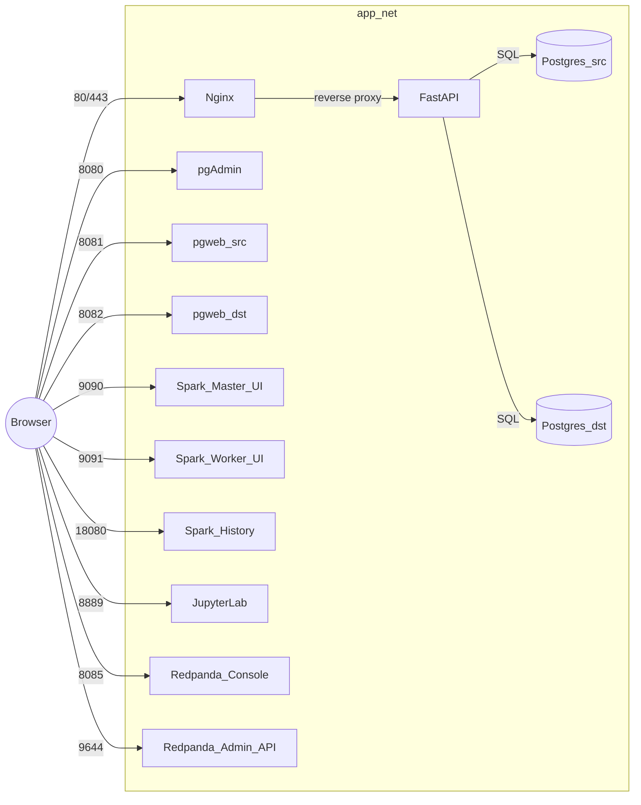

# Snowflake Terraform Demo

A portable, Terraform-managed development environment that stands up:

* **FastAPI** app (with hot reload for development)
* **Nginx** reverse proxy (public entry on port 80 → FastAPI)
* **Two PostgreSQL databases** (source & destination)
* **pgAdmin** (DB admin UI) on port **8080**
* **pgweb** (lightweight DB web UI) for source on **8081** and destination on **8082**
* **Apache Spark cluster** (master, workers, history server) on the shared Docker network
  * Spark Master UI → **9090**
  * Spark Worker UI → **9091**
  * Spark History UI → **18080**
* **JupyterLab (PySpark)** notebook environment on port **8889**
* Optional **MinIO** object storage service (S3-compatible) on ports **9000/9001**

---

## Phase One status
✅ Complete — FastAPI, Nginx, Postgres, pgAdmin, and pgweb run in Docker, managed by Terraform; routing verified.

## Phase Two status
🚧 In progress — Spark + Jupyter cluster integrated; MinIO optional service available.

---

## Table of Contents

* [Prerequisites](#prerequisites)
* [Repository Layout](#repository-layout)
* [Architecture](#architecture)
* [Quick Start](#quick-start)
* [Tear Everything Down](#tear-everything-down)
* [Terraform Commands](#terraform-commands)
* [Streaming Logs](#streaming-logs)
* [Service URLs](#service-urls)
* [Configuration (Variables)](#configuration-variables)
* [Development (Hot Reload)](#development-hot-reload)
* [Spark History](#spark-history)
* [Database Initialization](#database-initialization)
* [Nginx Routing Options](#nginx-routing-options)
* [Troubleshooting](#troubleshooting)
* [Testing](#testing-pytest)
* [Next Phases](#next-phases)

---

## Prerequisites

* **Docker** & **Docker Engine** running locally (Linux, macOS, or WSL2)
* **Terraform** v1.5+ (kreuzwerker/docker provider ~> 3.x)
* Bash shell (for the helper commands in this README)

> On Linux, you may also want to increase inotify watches for hot reload (see [Development](#development-hot-reload)).

---

## Repository Layout

```
app/                         # FastAPI application code (mounted into the container)
infra/
  docker/
    main.tf                  # Terraform resources (containers, network, volumes)
    variables.tf             # Terraform input variables with defaults
    outputs.tf               # Handy URLs & commands after apply
    db-init/                 # Optional SQL files executed on Postgres init (bind-mounted)
    nginx/
      nginx.conf             # Reverse proxy config (port 80 → FastAPI; optional 443)
      certs/                 # (optional) TLS certs if using HTTPS locally
```

> If you prefer Docker Compose, there is also an alternative compose-based layout you can evolve toward; for Phase One we standardize on Terraform.

---

## Architecture



All containers run on isolated Docker network app_net.

Published host ports: 80, 8080, 8081, 8082, 9090, 9091, 18080, 8889, 8085, 9644.

---

## Quick Start & Startup Instructions

### Quick Start

```bash
# From repo root
cp -n .env.example .env

terraform -chdir=infra/docker init

# Build a JSON var-file from .env and apply
awk -F= 'BEGIN{printf "{\n  \"env\": {"} NF==2 && $1 !~ /^[#]/ { gsub(/\r/, "", $2); gsub(/"/, "\\\"", $2); if(n++) printf ", "; printf "\n    \"%s\": \"%s\"", $1, $2 } END{printf "\n  }\n}\n"}' .env > /tmp/env.auto.tfvars.json

terraform -chdir=infra/docker apply -auto-approve -var-file=/tmp/env.auto.tfvars.json


# Verify ports & containers
docker ps --format 'table {{.Names}}\t{{.Ports}}'

# Smoke tests (via nginx)
curl http://localhost/
curl http://localhost/health

# Open UIs
# FastAPI (through nginx):   http://localhost/
# pgAdmin:                   http://localhost:8080/
# pgweb (source):            http://localhost:8081/
# pgweb (destination):       http://localhost:8082/
# Spark Master:              http://localhost:9090/
# Spark Worker-1:            http://localhost:9091/
# Spark History:             http://localhost:18080/
# JupyterLab:                http://localhost:8889/?token=dev
# Redpanda Console:          http://localhost:8085/
# Redpanda Admin Ready:      http://localhost:9644/v1/status/ready
```

## Startup Instructions

Follow these steps to get your development environment running:

1. **Clone the Repository**

   ```bash
   git clone https://github.com/Cole-Dylewski/snowflake-terraform-demo.git
   cd snowflake-terraform-demo
   git clone https://github.com/Cole-Dylewski/_utils
   ```

2. **Set Up Environment Variables**

   * Copy the example file:

     ```bash
     cp .env.example .env
     ```

   * Or run the helper script to generate and validate your `.env` file:

     ```bash
     chmod +x setup.sh
     ./setup.sh
     ```

   * Fill in any missing values when prompted.

   * The `.env` file is ignored by Git, so your secrets remain local.

3. **Build and Start Services (Terraform)**

   ```bash
   # From repo root
   terraform -chdir=infra/docker init

   # Apply using env map from .env
   # Create a JSON tfvars file from .env, then use -var-file
    awk -F= 'BEGIN{printf "{\n  \"env\": {"} NF==2 && $1 !~ /^[#]/ { gsub(/\r/, "", $2); gsub(/"/, "\\\"", $2); if(n++) printf ", "; printf "\n    \"%s\": \"%s\"", $1, $2 } END{printf "\n  }\n}\n"}' .env > /tmp/env.auto.tfvars.json
    cat /tmp/env.auto.tfvars.json  # sanity check
    terraform -chdir=infra/docker apply -auto-approve -var-file=/tmp/env.auto.tfvars.json

   ```

4. **Verify Services Are Running**

   ```bash
   docker ps --format 'table {{.Names}}\t{{.Ports}}'
   ```

5. **Access Services**

   | Service             | URL / Port                                         |
   | ------------------- | -------------------------------------------------- |
   | FastAPI (via nginx) | [http://localhost](http://localhost)               |
   | Health Check        | [http://localhost/health](http://localhost/health) |
   | Source DB UI        | [http://localhost:8081](http://localhost:8081)     |
   | Dest DB UI          | [http://localhost:8082](http://localhost:8082)     |
   | pgAdmin             | [http://localhost:8080](http://localhost:8080)     |
   | Spark Master        | [http://localhost:9090](http://localhost:9090)     |
   | Spark Worker        | [http://localhost:9091](http://localhost:9091)     |
   | Spark History       | [http://localhost:18080](http://localhost:18080)   |
   | JupyterLab          | [http://localhost:8889](http://localhost:8889)     |

6. **Stop Services**

   ```bash
   terraform -chdir=infra/docker destroy -auto-approve
   ```


💡 Tip: For Terraform-managed environments, remember to run:

```bash
terraform init
terraform apply
```

to provision and configure the infrastructure before bringing up the containers.


---

## Tear Everything Down

When you’re done experimenting, you may want to clean up **all containers, networks, images, and volumes** created by this project. There are two levels of teardown:

### 1. Standard Teardown (Terraform-managed only)

This will stop and remove only the containers, networks, volumes, and images that Terraform created for this project:

```bash
# From repo root
terraform -chdir=infra/docker destroy -auto-approve
```

If Terraform complains about resources being "in use", first remove any stuck containers and volumes, then rerun:

```bash
# Kill project containers if still alive
docker rm -f nginx api src_db dst_db pgadmin pgweb_src pgweb_dst 2>/dev/null || true

# Remove the project volumes
docker volume rm -f src_db_data dst_db_data 2>/dev/null || true

# Retry destroy
terraform -chdir=infra/docker destroy -auto-approve
```

If the state is corrupted (Terraform thinks resources exist when they don’t), you can remove them manually from the state:

```bash
terraform -chdir=infra/docker state rm \
  docker_image.nginx \
  docker_image.postgres \
  docker_image.api \
  docker_volume.src_db_data \
  docker_volume.dst_db_data
```

### 2. Nuclear Option (wipe **all** Docker)

If you want a completely fresh environment (⚠️ **this deletes everything in Docker**, not just this project), run:

```bash
# Kill ALL containers
docker rm -f $(docker ps -aq) 2>/dev/null || true

# Remove ALL volumes
docker volume rm -f $(docker volume ls -q) 2>/dev/null || true

# Remove ALL networks (except default ones)
docker network prune -f

# Remove ALL images
docker image prune -af
```

After this, Docker will be completely clean. The next `terraform apply` will rebuild everything from scratch.

---

## Terraform Commands


Terraform manages all containers, volumes, and networks under `infra/docker/`.

```bash
# Initialize providers (first run or after provider changes)
terraform -chdir=infra/docker init

# Build a JSON var-file from .env (key/value map into var.env)
awk -F= 'BEGIN{printf "{\n  \"env\": {"} NF==2 && $1 !~ /^[#]/ { gsub(/\r/, "", $2); gsub(/"/, "\\\"", $2); if(n++) printf ", "; printf "\n    \"%s\": \"%s\"", $1, $2 } END{printf "\n  }\n}\n"}' .env > /tmp/env.auto.tfvars.json

# Plan/apply with env map
terraform -chdir=infra/docker plan -var-file=/tmp/env.auto.tfvars.json
terraform -chdir=infra/docker apply -auto-approve -var-file=/tmp/env.auto.tfvars.json

# Show handy outputs (URLs)
terraform -chdir=infra/docker output

# Optional: target specific modules/resources during iteration
terraform -chdir=infra/docker apply -auto-approve -target=module.kafka
terraform -chdir=infra/docker apply -auto-approve -target=module.spark_cluster.docker_container.jupyter

# Destroy everything managed by Terraform
terraform -chdir=infra/docker destroy -auto-approve
````

If Docker gets into a weird state during development, a quick reset sequence:

```bash
docker ps -aq | xargs -r docker stop
docker ps -aq | xargs -r docker rm
docker network prune -f
# Optionally: docker volume prune -f   # (destructive: wipes DB data)
```

---
## Streaming Logs

### FastAPI (main app)
```bash
docker logs -f api
```

### Postgres (source & destination)
```bash
docker logs -f src_db
docker logs -f dst_db
```

### pgAdmin
```bash
docker logs -f pgadmin
```

### pgweb (source & destination)
```bash
docker logs -f pgweb_src
docker logs -f pgweb_dst
```

### Nginx
```bash
docker logs -f nginx
```

---

## 📑 Tips

- Add \`--tail 100\` if you only want the last 100 lines:
  \`\`\`bash
  docker logs -f --tail 100 api
  \`\`\`
- Open multiple terminals (one per service) to watch several logs at once.  
- To stop following, press \`Ctrl+C\`.
## Service URLs


* **FastAPI (via nginx)**: http://localhost/
  * Health: http://localhost/health
* **pgAdmin**: http://localhost:8080/
* **pgweb (source)**: http://localhost:8081/
* **pgweb (destination)**: http://localhost:8082/
* **Spark Master**: http://localhost:9090/
* **Spark Worker-1**: http://localhost:9091/
* **Spark History**: http://localhost:18080/
* **JupyterLab**: http://localhost:8889/
* **Redpanda Console**: http://localhost:8085/
* **Redpanda Admin (readiness)**: http://localhost:9644/v1/status/ready

**Direct Postgres from host**

* Source: `psql -h 127.0.0.1 -p 5433 -U src_user src_db`
* Destination: `psql -h 127.0.0.1 -p 5434 -U dst_user dst_db`

If you set a custom JUPYTER_TOKEN, open: `http://localhost:8889/?token=<your-token>`.

---

## Configuration (Variables)

Defaults live in `infra/docker/variables.tf` — override at apply-time with `-var` or a `.tfvars` file.

| Variable           |             Default | Purpose                                                    |
| ------------------ | ------------------: | ---------------------------------------------------------- |
| `src_db_user`      |          `src_user` | Source DB username                                         |
| `src_db_password`  |          `src_pass` | Source DB password                                         |
| `src_db_name`      |            `src_db` | Source DB name                                             |
| `dst_db_user`      |          `dst_user` | Destination DB username                                    |
| `dst_db_password`  |          `dst_pass` | Destination DB password                                    |
| `dst_db_name`      |            `dst_db` | Destination DB name                                        |
| `api_port`         |              `8000` | Host port for FastAPI container (Nginx still fronts on 80) |
| `src_host_port`    |              `5433` | Host port mapped to source Postgres                        |
| `dst_host_port`    |              `5434` | Host port mapped to destination Postgres                   |
| `pgadmin_port`     |              `8080` | Host port for pgAdmin                                      |
| `pgadmin_email`    | `admin@example.com` | pgAdmin admin login                                        |
| `pgadmin_password` |             `admin` | pgAdmin admin password                                     |
| `http_port`        |                `80` | Host port for Nginx                                        |
| `pgweb_src_port`   |              `8081` | Host port for pgweb (source)                               |
| `pgweb_dst_port`   |              `8082` | Host port for pgweb (destination)                          |
| `SPARK_WORKER_COUNT`   |   `1`   | Number of Spark workers               |
| `SPARK_WORKER_CORES`   |   `2`   | Cores per worker                      |
| `SPARK_WORKER_MEMORY`  |   `2g`  | Memory per worker                     |
| `JUPYTER_PORT`         |  `8889` | Host port for JupyterLab              |
| `JUPYTER_TOKEN`        |  `dev`  | Jupyter token (URL auth)              |
| `SPARK_MASTER_PORT`    |  `7077` | Spark master RPC port                 |
| `SPARK_MASTER_UI_PORT` |  `9090` | Spark master UI port                  |
| `SPARK_WORKER_UI_BASE` |  `9091` | First worker UI port                  |
| `SPARK_HISTORY_PORT`   | `18080` | History server UI port                |
| `ENABLE_MINIO`         | `false` | Enable S3-compatible MinIO (optional) |

**Examples:**

```bash
# Change pgAdmin port
terraform -chdir=infra/docker apply -auto-approve -var pgadmin_port=9090

# Use non-default DB creds
terraform -chdir=infra/docker apply -auto-approve \
  -var src_db_user=alice -var src_db_password=secret -var src_db_name=src
```

---

## Development (Hot Reload)

The FastAPI container mounts your local `app/` folder and runs `uvicorn` with `--reload` so code changes trigger automatic restarts.

**Health endpoint**: `/health` (container HEALTHCHECK hits `http://127.0.0.1:8000/health`).

If reloads don’t trigger on Linux, increase file watch limits:

```bash
echo fs.inotify.max_user_watches=524288 | sudo tee -a /etc/sysctl.conf
echo fs.inotify.max_user_instances=1024 | sudo tee -a /etc/sysctl.conf
sudo sysctl -p
```

**Dependency changes**  
The Dockerfile uses a build arg `REQ_HASH` (hash of `requirements.txt`). When you edit `app/requirements.txt`, a subsequent `terraform apply` will rebuild the FastAPI image automatically:

```bash
# Add a dependency
echo "pandas" >> app/requirements.txt

# Rebuild via Terraform
terraform -chdir=infra/docker apply -auto-approve
```

When you only change Python code (not requirements), hot reload picks it up instantly (no rebuild needed).

---
### Jupyter (container) dependencies

You can install extra Python packages inside the **JupyterLab** container at startup via a bind-mounted requirements file.

1. Create or edit `infra/requirements-jupyter.txt`, e.g.:

```text
pyspark
pandas
matplotlib
requests
```

2. On container start, this file is mounted to `/tmp/requirements.txt` and the container runs:

```bash
pip install -r /tmp/requirements.txt && exec start-notebook.sh
```

3. Recreate Jupyter to apply changes:

```bash
terraform -chdir=infra/docker apply -auto-approve -target=module.spark_cluster.docker_container.jupyter
```

---
## Spark History

### Spark History UI requires event logs

The History Server displays applications **only after** it finds Spark event logs in the shared volume.

* Shared Docker volume: `spark_events`
* Mounted path (in Spark/Jupyter containers): `/opt/bitnami/spark/tmp/spark-events`
* Jupyter/driver must set:

  * `spark.eventLog.enabled=true`
  * `spark.eventLog.dir=file:/opt/bitnami/spark/tmp/spark-events`

These settings are already injected into the Jupyter container via `PYSPARK_SUBMIT_ARGS`.

#### Quick test (inside Jupyter)

Create a new notebook and run:

```python
from pyspark.sql import SparkSession
spark = (SparkSession.builder
         .master("spark://spark-master:7077")
         .appName("hist-check")
         .getOrCreate())

spark.range(100000).selectExpr("sum(id)").show()
spark.stop()
```

Then open **[http://localhost:18080/](http://localhost:18080/)**.

#### If permissions block writing event logs

Run once in the Spark master container to ensure the directory exists and is world‑writable:

```bash
docker exec -it spark-master bash -lc 'mkdir -p /opt/bitnami/spark/tmp/spark-events && chmod 0777 /opt/bitnami/spark/tmp/spark-events'
```

---
## Database Initialization

Place SQL files under `infra/docker/db-init/`. They are bind-mounted into both Postgres containers at `/docker-entrypoint-initdb.d` and executed **once** when a new data directory is created.

**Example:** `infra/docker/db-init/001_seed.sql`

```sql
-- Source DB seed
CREATE TABLE IF NOT EXISTS events_src(id SERIAL PRIMARY KEY, note TEXT);
INSERT INTO events_src(note) VALUES ('seed 1'),('seed 2'),('seed 3');

-- Destination DB seed
CREATE TABLE IF NOT EXISTS events_dst(id SERIAL PRIMARY KEY, note TEXT);
INSERT INTO events_dst(note) VALUES ('seed A'),('seed B'),('seed C');
```

> Re-running seeds requires wiping the associated Docker **volume** (destructive).

---

## Nginx Routing Options

**Current Phase One:** Nginx proxies **all** paths on port **80** to FastAPI at `api:8000`.

Alternative (prefix API only):

```nginx
# nginx.conf
location = /api/v2 { return 308 /api/v2/; }
location ^~ /api/v2/ {
  proxy_set_header Host $host;
  proxy_set_header X-Real-IP $remote_addr;
  proxy_set_header X-Forwarded-For $proxy_add_x_forwarded_for;
  proxy_set_header X-Forwarded-Proto $scheme;
  proxy_pass http://api:8000/;  # strips /api/v2/
}
```

With that change, you’d hit FastAPI at `http://localhost/api/v2/...` while pgAdmin/pgweb stay on their ports.

> If your browser auto-upgrades `http://localhost` to `https://localhost` and you’re not using local TLS, visit `http://127.0.0.1/` or disable HSTS for localhost. Optional local TLS is supported via mounted certs in `infra/docker/nginx/certs`.

---

## Troubleshooting

**Port already allocated / conflicts**

* Ensure only Nginx publishes `:80`. The API container should **not** bind to host `:80`.
* Check: `docker ps --format 'table {{.Names}}\t{{.Ports}}'`

**Nginx can’t find upstream `api:8000`**

* Make sure both `nginx` and `api` are on the `app_net` network.
* Use Docker’s DNS in nginx.conf: `resolver 127.0.0.11 ipv6=off valid=30s;`
* Test config inside the container: `docker exec nginx nginx -t`

**Redpanda health & readiness**

* Terraform defines a **healthcheck** on the Redpanda container (Admin API port).
* Readiness endpoint (host): `http://localhost:9644/v1/status/ready` → `{ "status": "ready" }` when OK.

**Useful commands**

```bash
docker inspect --format '{{.State.Health.Status}}' redpanda || echo "no health section"
curl -s http://localhost:9644/v1/status/ready | jq .
```

**Bind mount path must be absolute**

* Terraform uses: `source = abspath("${path.module}/db-init")`

**Containers won’t hot-reload**

* Raise inotify limits (see [Development](#development-hot-reload)).

**Reset the environment**

```bash
docker rm -f nginx api pgadmin pgweb_src pgweb_dst 2>/dev/null || true
terraform -chdir=infra/docker destroy -auto-approve || true
terraform -chdir=infra/docker apply -auto-approve
```

---

## Testing (pytest)


````markdown
## Testing (pytest)

A lightweight test suite validates key endpoints, ports, and Terraform outputs.

### Install test deps (host)
```bash
python -m venv .venv && source .venv/bin/activate
pip install -U pip pytest requests
````

### Layout

* Tests live at **`.py/tests/test_stack.py`**.
* Configure pytest discovery via **`pytest.ini`** at repo root.

**`pytest.ini`**

```ini
[pytest]
testpaths = .py/tests
python_files = test_*.py
```

**`.py/tests/test_stack.py`**

```python
import os, json, time, socket, subprocess as sp
from pathlib import Path
import requests as R

TIMEOUT = float(os.getenv("TEST_TIMEOUT", 5))
RETRIES = int(os.getenv("TEST_RETRIES", 10))
SLEEP   = float(os.getenv("TEST_SLEEP", 1))

TF_DIR = os.environ.get(
    "TF_DIR",
    str(Path(__file__).resolve().parents[2] / "infra/docker")
)

URLS = {
    "nginx_root": "http://localhost/",
    "fastapi_direct": "http://localhost:8000/",
    "pgadmin": "http://localhost:8080/",
    "pgweb_src": "http://localhost:8081/",
    "pgweb_dst": "http://localhost:8082/",
    "spark_master": "http://localhost:9090/",
    "spark_worker1": "http://localhost:9091/",
    "spark_history": "http://localhost:18080/",
    "jupyter": "http://localhost:8889/",
    "redpanda_console": "http://localhost:8085/",
    "redpanda_ready": "http://localhost:9644/v1/status/ready",
}

ALLOWED = {
    "jupyter": {200, 302},  # token redirects allowed
}


def wait_http(url, ok_codes=None):
    ok = ok_codes or {200}
    last = None
    for _ in range(RETRIES):
        try:
            r = R.get(url, timeout=TIMEOUT, allow_redirects=False)
            if r.status_code in ok:
                return r
            last = r
        except Exception as e:
            last = e
        time.sleep(SLEEP)
    raise AssertionError(f"failed: {url} -> {getattr(last, 'status_code', last)}")


def test_nginx_root():
    assert wait_http(URLS["nginx_root"]).status_code == 200


def test_fastapi_direct():
    assert wait_http(URLS["fastapi_direct"]).status_code == 200


def test_redpanda_ready():
    r = wait_http(URLS["redpanda_ready"]).json()
    assert r.get("status") == "ready"


def test_redpanda_console():
    assert wait_http(URLS["redpanda_console"]).status_code == 200


def test_spark_master_ui():
    assert wait_http(URLS["spark_master"]).status_code == 200


def test_spark_worker_ui():
    assert wait_http(URLS["spark_worker1"]).status_code == 200


def test_spark_history_ui():
    # History UI appears only after some event logs exist;
    # we'll tolerate connection refusal by marking as xfail when closed.
    try:
        r = wait_http(URLS["spark_history"])  # 200 when logs exist
        assert r.status_code == 200
    except AssertionError as e:
        import pytest
        pytest.xfail(f"Spark History may be empty yet: {e}")


def test_jupyter():
    allowed = ALLOWED.get("jupyter", {200})
    assert wait_http(URLS["jupyter"], ok_codes=allowed).status_code in allowed


def test_pgweb_src():
    assert wait_http(URLS["pgweb_src"]).status_code == 200


def test_pgweb_dst():
    assert wait_http(URLS["pgweb_dst"]).status_code == 200


def test_pgadmin():
    assert wait_http(URLS["pgadmin"]).status_code == 200


def test_terraform_outputs_present():
    # Not asserting reachability here (covered above), just that TF exposes URLs
    if sp.run(["bash","-lc","command -v terraform >/dev/null 2>&1"]).returncode:
        return  # terraform not installed in CI
    p = sp.run(["bash","-lc", f"terraform -chdir='{TF_DIR}' output -json"], capture_output=True, text=True)
    assert p.returncode == 0, p.stderr
    data = json.loads(p.stdout)
    keys = {"app_url","pgadmin_url","pgweb_src_url","pgweb_dst_url","redpanda_console_url","redpanda_admin_url"}
    missing = [k for k in keys if k not in data]
    assert not missing, f"missing outputs: {missing}"
```

### Run tests

```bash
pytest -q -s .py/tests/test_stack.py
# or, with config in pytest.ini
pytest -q -s
```

````

## Next Phases

* **Phase Two:** Real data flows & background jobs (ETL/ELT) between source and destination. Alpaca/Kafka → Spark Structured Streaming → Snowflake
* **Phase Three:** Harden for staging/prod: TLS (Caddy or Nginx + certs), authn/z, observability, backups.
* **Snowflake Integration:** Extend the Terraform stack to provision Snowflake resources and wire an ingestion path.

---

**License:** MIT
